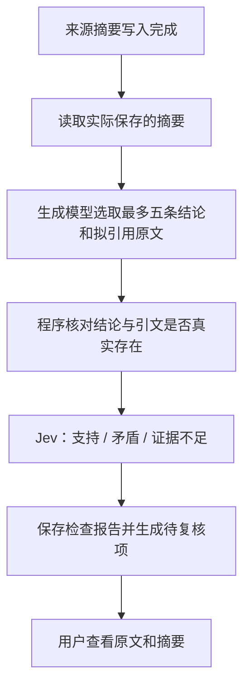

# LLM Wiki × Jev：需求背景、首版改造与设计判断

日期：2026-09-20。适用范围：[Castor6/llm_wiki PR #1](https://github.com/Castor6/llm_wiki/pull/1)，首版实现提交 `df046a7`。本文记录已经实现的行为、选择这些环节的理由，以及尚待验证的产品假设。

## 1. 我们要做什么

我们要做一个面向不同用户与知识领域的通用开源产品：用户持续导入资料，系统将资料整理为可以阅读、提问和持续维护的 Wiki。桌面应用是当前交付形态；产品目标不局限于个人研究用途，也没有在首版承诺多人协作或 SaaS 服务。

Karpathy 的 LLM Wiki 思路把知识库视为持续维护的成果：新来源进入后，模型更新摘要、实体、主题和交叉链接，让后续阅读和提问复用此前的整理工作。[原始构想](https://gist.github.com/karpathy/442a6bf555914893e9891c11519de94f)

我们选择 Fork [nashsu/llm_wiki](https://github.com/nashsu/llm_wiki)，复用已有的导入解析、Wiki 页面、任务队列、检索、图谱、问答和 Review 界面。项目采用开源路线，保留上游 GPLv3 许可及声明。这样可以把首批研发投入放在 Jev 是否能改善知识维护质量上。

随着资料增加，两类错误值得优先关注：

1. **同一概念被拆成多个页面，或相关但不同的对象被建议合并。** 这会影响导航、检索和后续内容归属。
2. **生成的摘要扩大了原文结论的适用范围，或给出了原文并未支持的说法。** 一旦写入 Wiki，这类说法可能被后续阅读和回答反复使用。

因此，首版希望在现有生成流程中增加可单独检查的语义判断，并把需要处理的问题交给用户复核。它是否比现有方案更准确、更省钱或更省人工，仍是需要实验验证的假设。

## 2. 为什么引入 Jev，以及如何分工

TypeSafe 将 Jev 定位为结构化判断模型：输入状态和有类型的问题，返回 Choice、Score 或 Noul 结果。它适合输入明确、范围有限的判断任务；开放式写作仍需要生成模型。[TypeSafe Introduction](https://docs.typesafe.ai/introduction)

基于这个能力边界，我们采用以下分工：

| 组件 | 首版职责 | 选择理由 |
| --- | --- | --- |
| 原有生成模型 | 抽取信息、提出重复候选、写作和合并正文、问答；为引用检查选取候选结论与引文 | 这些工作需要开放式生成或综合能力 |
| Jev | 判断候选页面是否描述同一对象；判断给定原文上下文与结论的支持关系 | 输入与选项可以限定，结果能够直接进入程序分支 |
| 程序 | 候选去重、引文定位、长度限制、缓存、失败与取消处理、持久化 | 存在性和状态管理可以确定性执行 |
| 用户 | 确认页面合并，处理需要复核的结论 | 首版缺少足够的领域评测，不把模型结果直接变成高影响操作 |

客户端实现了三类题型；两个业务环节目前使用 **Choice**，设置页连接测试使用 **Noul**，**Score 尚未用于业务决策**。引用候选的抽取仍需要解析生成模型输出，并没有因为引入 Jev 而消除所有生成错误。

## 3. 已经改造了哪些环节

### 3.1 重复条目检测：增加候选对的身份复核

原流程已经能够召回实体摘要、可选地用 embedding 缩小范围，再由生成模型提出重复候选组。首版在候选形成后加入 Jev：

具体行为：

- 对每一对候选传入标题、类型、简介和标签，区分别名、翻译、缩写与仅仅相关的概念、版本或同名对象。
- `different` 且 confidence ≥ 0.85 时，从本次建议中移除；低确定性的 `different` 和 `uncertain` 保留为低确定性候选。
- `same` 按 0.85、0.5 两个阈值映射为高、中、低等级；这些等级不触发自动合并。
- 尊重用户此前标记的“不重复”配对；不因为 A 与 B、B 与 C 相似，就推断 A 与 C 可以一起合并。
- 最多处理 200 个候选对，超出时明确报错；输入简介有长度限制。没有召回的重复页面，Jev 不会在这一步发现。
- Jev 服务失败时向调用方返回错误，不把未经复核的结果当成已检查结果展示。关闭 Jev 时保留原流程。

**为什么值得先改这里：** 对象身份是后续内容归属的基础；“是否同一对象”又比“重写整篇页面”更容易拆成限定输入的判断。已有候选召回和合并界面让这一改造无需重建产品。保留人工确认，也便于收集错误建议和遗漏建议，判断增加一次复核是否值得。

例如，“检索增强生成”和“Retrieval-Augmented Generation”可能是别名；两个不同产品版本则可能只是相关。以上例子用于说明判断边界，并非已经完成的专项模型评测。

实现入口：[dedup-runner.ts](src/lib/dedup-runner.ts)、[jev-dedup.ts](src/lib/jev-dedup.ts)。

### 3.2 来源摘要引用抽查：检查结论有没有得到原文支持

首版在来源摘要实际写入后检查保存的正文。生成模型从中选取最多五条事实性结论及拟引用的原文；程序先核对文本存在性，再调用 Jev 做语义判断。

具体行为：

1. 结论必须能在保存后的摘要中找到；拟引用文本必须能在原始解析文本中找到，匹配时允许空白差异。
2. 没有引文或引文不存在时，直接标记证据不足或未找到引文，不为该条调用 Jev。
3. 引文存在时，发送结论、引文及前后局部上下文，判断是否支持完整结论，包括对象、范围与条件。
4. 只有 `supports` 且 confidence ≥ 0.85 的抽样项不产生告警；矛盾、证据不足、引文缺失和低确定性支持进入 Review。
5. 报告写入项目的 `.llm-wiki/jev-citations/`，记录选中结论、引文、判断、模型版本、概率分布和用量。复核项提供原文及摘要入口。

**为什么值得先改这里：** 引文存在并不等于引文支持结论。程序适合做“找得到吗”，语义模型适合补充判断“原文真的这样说了吗”。例如原文仅声明“支持英语”，摘要却写成“支持所有语言”，文本定位检查无法独立发现范围被扩大，支持关系判断则有机会发现。

**为什么放在写入后：** 现有摄入流程可能在写入时进一步合并或修改正文。检查保存后的摘要，才能对齐用户实际读到的内容。为控制首版改动范围，目前采用写入后的抽样提示；它不会阻止写入，也不会覆盖整篇 Wiki、所有主题页或聊天回答。

首版范围限制为原文最多 28,000 字符、摘要正文最多 12,000 字符。这是应用当前选择的处理范围，不是 Jev 的模型 token 上限。超出范围、抽取失败、服务失败或检查期间摘要变化时，生成“检查待完成”项。重新导入未变化的来源也可以重试。

这个环节仍有盲区：生成模型可能没选到错误结论；局部上下文可能缺少远处的限定条件；来源本身也可能错误。没有告警不等于整篇摘要可靠。

实现入口：[ingest.ts](src/lib/ingest.ts)、[jev-citations.ts](src/lib/jev-citations.ts)、[jev-ingest-review.ts](src/lib/jev-ingest-review.ts)。

### 3.3 独立配置与可追踪的检查状态

新增「设置 → Jev」分类，默认关闭，包含掩码 Key 输入、固定模型版本 `jev-1.13.0`、超时和合成文本连接测试。生成模型配置独立保留。

客户端提供响应校验、有限重试、总超时与取消处理；错误信息不包含 Key 或服务端原始响应。API Key 沿用应用已有的全局配置存储，不放入项目导出；它并不是系统钥匙串加密存储。启用后的相关文本会发送到 TypeSafe API。开发测试使用 Git 忽略的 `.env.test.local`，该文件不配置运行中的桌面应用。

引用检查缓存包含原文、保存的摘要、配置模型和抽查流程版本。固定数字模型版本可以复用缓存，移动别名会重新检查。后续检查会把过期告警标记为已被新检查替代；这类告警再次出现时会重新打开，用户明确处理过的相同复核项保留处理状态。

**为什么这些配套值得做：** 产品需要区分“检查过且未发现问题”“需要复核”和“检查没有完成”。否则即使模型判断有价值，超时、缓存过期或重试也可能把结果变得不可用。独立开关还让用户可以渐进启用，并便于之后做对照评测。

实现入口：[jev-client.ts](src/lib/jev-client.ts)、[jev-config.ts](src/lib/jev-config.ts)、[jev-section.tsx](src/components/settings/sections/jev-section.tsx)、[project-store.ts](src/lib/project-store.ts)。

## 4. 这些改造依据什么判断，尚有哪些不确定性

优先选择去重和引用检查，依据的是三个工程条件：问题可以限定为少量选项；错误会影响长期知识维护；现有产品已经有承接结果的界面。这是对接入价值与改造成本的判断，不是对 Jev 准确率的结论。

Jev 的 confidence 来自输出概率分布的集中程度，不代表事实正确率。0.85 和 0.5 是首版分流规则，需要用实际领域、语言和任务的数据校准。[Confidence 说明](https://docs.typesafe.ai/confidence)

官方列出的局限包括数值精度、日期比较、多层间接推理、无关上下文干扰及对抗性内容。因此，我们把精确文本检查和状态逻辑留在程序中，给语义判断提供有限上下文。提示词要求将资料视为数据，但这不能单独构成完整的提示注入防护。[Jev 1.13 已知局限](https://docs.typesafe.ai/model-jaggedness/jev-1.13)

目前没有改造全库知识一致性、来源撤回后的依赖传播、结论级版本图谱或全量自动纠错，也没有用 Jev 替换全文生成、聊天和复杂综合分析。上述能力需要更多数据结构、检索与评测，不能从本次两个判断入口自然推导为已经具备。

## 5. 已验证到什么程度

以下结果均对应 2026-09-20 的首版实现：

| 检查 | 结果 | 能说明什么 |
| --- | --- | --- |
| `npm run test:mocks` | 137 个文件、1,933 项测试通过 | 包含原有回归测试和新增的配置、API、去重、引用及重试测试；不是 1,933 项模型评测 |
| `npm run build` | TypeScript 与 Vite 生产构建通过 | 前端代码能够编译和打包 |
| 设置页浏览器检查 | 使用临时内存存储和 HTTP 模拟，交互与布局通过 | 设置页基本行为正常；没有验证原生 Tauri 持久化 |
| `npm run test:jev:live` | 3 次真实 API 测试全部通过，实际返回 `jev-1.13.0` | 英文与中文合成样例正确区分支持、矛盾、证据不足；引用 helper 正确识别矛盾 |
| 原生桌面构建 | 尚未在本机执行 | 本机缺少 Rust 工具链，不能把前端构建通过等同于桌面安装包验证通过 |

真实 API 测试只发送合成文本。它覆盖基础 API 与引用 helper，没有覆盖整条 GUI 导入流程、真实资料上的重复判断质量或大规模知识库表现。

## 6. 下一步如何验证它是否真的值得保留

建议固定资料、生成模型和候选集合，对比三组：原流程、增加同一生成模型复核、增加 Jev 复核。按中文/英文、资料类型与知识领域分别报告结果，保留未参与调整提示词和阈值的测试集。

| 环节 | 优先测量 | 需要避免的误判 |
| --- | --- | --- |
| 重复检测 | 错误合并建议、被错误过滤的真实重复、候选覆盖率、用户接受比例 | 仅看建议数量减少就认为质量提升 |
| 引用检查 | 无依据或范围扩大结论的漏报、误报、人工复核耗时 | 抽样没覆盖到错误，却被统计为整篇检查通过 |
| 使用成本 | 额外调用量、费用、延迟、失败与重试率 | 只计算 Jev 调用，忽略生成模型抽取候选的额外成本 |

当前合理的产品决策是保留独立开关和提示式复核，用真实数据决定是否扩大检查范围、调整阈值或加入自动操作。若额外复核没有带来可衡量收益，应调整入口、检索和问题设计，而不是只增加模型调用次数。

## 7. 发行配置与发布流程

首个独立发行版本为 **LLM Wiki Jev 0.7.0**。应用标识使用 `io.github.castor6.llmwiki`，更新检查、关于页面和下载入口指向 `Castor6/llm_wiki`；全局配置与上游应用分开。

**合并 PR 不会直接公开 Release。** 发行流程将代码检查、试包和公开发布分开：

| 操作 | 工作流行为 | 是否发布 GitHub Release |
| --- | --- | --- |
| 向 `main` 提 PR，或合并后产生 `main` push | CI 执行 mock 单元测试、TypeScript/前端构建、版本一致性检查，以及 MCP/Rust 构建检查 | 否 |
| 手动运行 `Build & Release` | 检查通过后构建四个平台安装包和浏览器扩展，上传 Actions artifacts，保留 14 天 | 否 |
| 推送名称匹配 `v*` 的 Git 标签 | 校验标签与应用版本一致；全部打包成功后集中创建草稿、上传并回下载校验 SHA256，再公开 | 是；稳定版本正式发布，含预发布后缀的版本标记为 prerelease |

依据：[ci.yml](.github/workflows/ci.yml)、[build.yml](.github/workflows/build.yml)、[发布校验脚本](scripts/verify-release.mjs)。四个平台分别是 macOS Apple Silicon、Windows、Linux x86_64 和 Linux ARM64；没有单独的 Intel Mac 构建。

这一轮还完成了以下发行配置：

- **Fork Actions 已启用。** GitHub API 已能列出状态为 active 的 CI 与 Build & Release。实际运行结果可在 [Actions 页面](https://github.com/Castor6/llm_wiki/actions)查看。
- **统一版本号。** 应用、锁文件、Tauri 与 Cargo 版本同步为 0.7.0；脚本检查它们一致，并要求发布标签严格匹配。源码指引中的版本也纳入检查。
- **完整发布后才公开。** 各平台先保存构建产物，集中发布任务等待所有必要任务成功，再检查必需包格式、文件名和校验值。构建失败不会提前公开一个缺少平台产物的版本。
- **随包附带许可与源码入口。** 安装包和 Windows 便携包附带 LICENSE 与发行声明；Release 提供对应标签的源码与构建说明。
- **签名状态明确。** 当前仓库没有 Apple 签名与公证凭据，Windows 代码签名也未配置。首版发布说明明确标注这些状态，不能把打包成功等同于平台签名或公证通过。

**打包不需要 Jev API Key。** 自动化只运行 mock 测试，不运行付费真实 Jev 测试，也不内置开发者 Key。最终用户在设置中配置自己的凭据。

首次发布按以下顺序执行：完成代码检查与合并 → 手动打包 → 安装试用可访问平台的产物 → 为同一版代码推送版本标签 → 等所有平台构建与产物校验通过后公开。发布后的标签不移动，后续修复使用新版本。维护者操作见 [RELEASING.md](RELEASING.md)，实际发行状态见 [Releases](https://github.com/Castor6/llm_wiki/releases)。

## 8. 使用与维护入口

- 配置方式、测试命令和存储说明：[JEV.md](JEV.md)。
- 当前改动与验证记录：[PR #1](https://github.com/Castor6/llm_wiki/pull/1)。
- 模型接口：[TypeSafe API](https://docs.typesafe.ai/api)。

本文以实际首版实现为准。早期设计中更完整的结论追溯、提交前门禁和自动增量修复属于后续方向，不属于本 PR 的交付范围。
